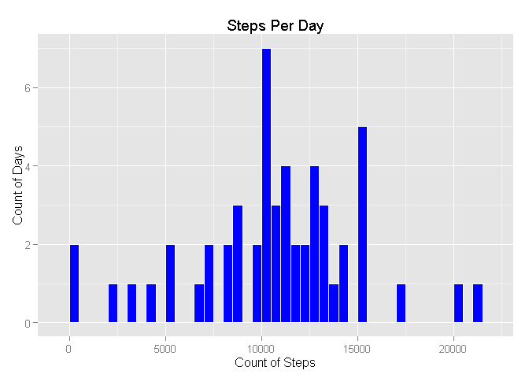
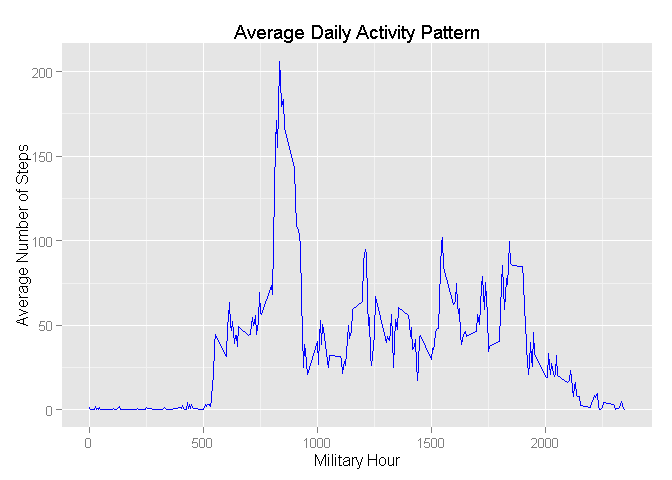
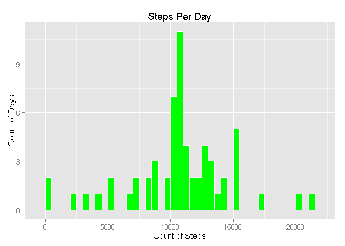
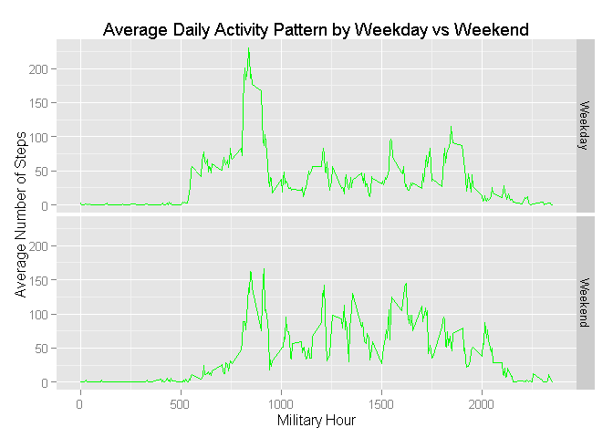

# Reproducible Research: Peer Assessment 1
by Robert Jeong  


## Loading and preprocessing the data
The following script assumes fork/clone of the GitHub repository created for this assignment from [Roger Peng](http://github.com/rdpeng/RepData_PeerAssessment1).  

* Load the data (i.e. `read.csv()`)

```r
# Read in the data file into a variable, ACT, stored in the subfolder Data of the same working directory of markdown file.
# But first check if it exists and skip, otherwise create it 
if (!exists("ACT")) {
  if (!file.exists("./Data/activity.csv")) {
    unzip("activity.zip", overwrite = TRUE, exdir = "./Data")
    ACT <- read.csv("Data/activity.csv", na.strings = "NA")
  } else {
      ACT <- read.csv("Data/activity.csv", na.strings = "NA")
}}
```

* Process/transform the data (if necessary) into a format suitable for your analysis  

```r
# Get complete cases and store into separate variable
CDATA <- ACT[complete.cases(ACT),]
summary(CDATA)
```

```
##      steps                date          interval     
##  Min.   :  0.00   2012-10-02:  288   Min.   :   0.0  
##  1st Qu.:  0.00   2012-10-03:  288   1st Qu.: 588.8  
##  Median :  0.00   2012-10-04:  288   Median :1177.5  
##  Mean   : 37.38   2012-10-05:  288   Mean   :1177.5  
##  3rd Qu.: 12.00   2012-10-06:  288   3rd Qu.:1766.2  
##  Max.   :806.00   2012-10-07:  288   Max.   :2355.0  
##                   (Other)   :13536
```

```r
str(CDATA)
```

```
## 'data.frame':	15264 obs. of  3 variables:
##  $ steps   : int  0 0 0 0 0 0 0 0 0 0 ...
##  $ date    : Factor w/ 61 levels "2012-10-01","2012-10-02",..: 2 2 2 2 2 2 2 2 2 2 ...
##  $ interval: int  0 5 10 15 20 25 30 35 40 45 ...
```
****  

## What is mean total number of steps taken per day?  
* Calculate the total number of steps taken per day  

```r
StepsPerDay <- aggregate(steps ~ date, CDATA, sum)
head(StepsPerDay)
```

```
##         date steps
## 1 2012-10-02   126
## 2 2012-10-03 11352
## 3 2012-10-04 12116
## 4 2012-10-05 13294
## 5 2012-10-06 15420
## 6 2012-10-07 11015
```

* Make a histogram of the total number of steps taken each day  

```r
# Install ggplot2 if it's not loaded in the current system
if ("ggplot2" %in% rownames(installed.packages()) != TRUE) {
  install.packages("ggplot2")
}
library(ggplot2)

## What is the average daily activity pattern?
# Histogram
ggplot(StepsPerDay, aes(x = steps)) + geom_histogram(fill = "blue", col="white", binwidth = 500) + labs(title = "Steps Per Day", x = "Count of Steps", y = "Count of Days")
```

 

* Calculate and report the mean and median of the total number of steps taken per day  

```r
# Statistical Summary
summary(StepsPerDay$steps)
```

```
##    Min. 1st Qu.  Median    Mean 3rd Qu.    Max. 
##      41    8841   10760   10770   13290   21190
```
****  

## What is the average daily activity pattern?  
* Make a time series plot (i.e. `type = "l"`) of the 5-minute interval (x-axis) and the average number of steps taken, averaged across all days (y-axis)  

```r
Activity <- aggregate(steps ~ interval, CDATA, mean, na.rm = TRUE)
ggplot(Activity, aes(x = interval, y = steps)) + geom_line(col="blue") + labs(title = "Average Daily Activity Pattern", x = "Military Hour", y = "Average Number of Steps")
```

 

* Which 5-minute interval, on average across all the days in the dataset, contains the maximum number of steps?

```r
Activity[which.max(Activity$steps),] 
```

```
##     interval    steps
## 104      835 206.1698
```
######Thus, 835 hour is the most active part of the day on average.
****  

## Imputing missing values  
* Calculate and report the total number of missing values in the dataset (i.e. the total number of rows with NAs)

```r
summary(ACT)
```

```
##      steps                date          interval     
##  Min.   :  0.00   2012-10-01:  288   Min.   :   0.0  
##  1st Qu.:  0.00   2012-10-02:  288   1st Qu.: 588.8  
##  Median :  0.00   2012-10-03:  288   Median :1177.5  
##  Mean   : 37.38   2012-10-04:  288   Mean   :1177.5  
##  3rd Qu.: 12.00   2012-10-05:  288   3rd Qu.:1766.2  
##  Max.   :806.00   2012-10-06:  288   Max.   :2355.0  
##  NA's   :2304     (Other)   :15840
```

```r
NA_records <- ACT[is.na(ACT$steps),]
NROW(NA_records)
```
    ## 2304 is the total number of missing rows in the dataset  
  
* Create a new dataset that is equal to the original dataset but with the missing data filled in. Devise a strategy for filling in all of the missing values in the dataset. The strategy does not need to be sophisticated. For example, you could use the mean/median for that day, or the mean for that 5-minute interval, etc.
    + Elected to use the mean from the 5-minute interval previously calculated with data.frame `Activity`  
    

```r
# Create a function to return the Step mean value given the interval on the Activity data.frame
na_replace <- function(int1) {
        return(Activity$steps[which(Activity$interval==int1)])
        }

# Update the NA values with the mean value for the interval using the function above
Filled_records <- NA_records


for (i in 1:NROW(Filled_records))
{
Filled_records[i,1] = na_replace(Filled_records[i,3])
}

# Check for NAs in the Filled_records data.frame. Zero means there are no more NAs in the data.frame
sum(is.na(Filled_records$steps))
```

```
## [1] 0
```

```r
# Create a new dataset joining the CDATA with Filled_records
CDATA2 <- rbind(CDATA, Filled_records)

str(CDATA)
```

```
## 'data.frame':	15264 obs. of  3 variables:
##  $ steps   : int  0 0 0 0 0 0 0 0 0 0 ...
##  $ date    : Factor w/ 61 levels "2012-10-01","2012-10-02",..: 2 2 2 2 2 2 2 2 2 2 ...
##  $ interval: int  0 5 10 15 20 25 30 35 40 45 ...
```

```r
str(CDATA2)
```

```
## 'data.frame':	17568 obs. of  3 variables:
##  $ steps   : num  0 0 0 0 0 0 0 0 0 0 ...
##  $ date    : Factor w/ 61 levels "2012-10-01","2012-10-02",..: 2 2 2 2 2 2 2 2 2 2 ...
##  $ interval: int  0 5 10 15 20 25 30 35 40 45 ...
```

* Make a histogram of the total number of steps taken each day and Calculate and report the mean and median total number of steps taken per day. Do these values differ from the estimates from the first part of the assignment? What is the impact of imputing missing data on the estimates of the total daily number of steps

```r
# Activity with new complete dataset in CDATA2
StepsPerDay2 <- aggregate(steps ~ date, CDATA2, sum)
head(StepsPerDay2)
```

```
##         date    steps
## 1 2012-10-01 10766.19
## 2 2012-10-02   126.00
## 3 2012-10-03 11352.00
## 4 2012-10-04 12116.00
## 5 2012-10-05 13294.00
## 6 2012-10-06 15420.00
```

```r
# Install ggplot2 if it's not loaded in the current system
if ("ggplot2" %in% rownames(installed.packages()) != TRUE) {
  install.packages("ggplot2")
}
library(ggplot2)

# Histogram
ggplot(StepsPerDay2, aes(x = steps)) + geom_histogram(fill = "green", col="white", binwidth = 500) + labs(title = "Steps Per Day", x = "Count of Steps", y = "Count of Days")
```

 

* Calculate and report the mean and median of the total number of steps taken per day  

```r
# Statistical Summary
summary(StepsPerDay2$steps)
```

```
##    Min. 1st Qu.  Median    Mean 3rd Qu.    Max. 
##      41    9819   10770   10770   12810   21190
```
  
## Are there differences in activity patterns between weekdays and weekends?  
* Create a new factor variable in the dataset with two levels – “weekday” and “weekend” indicating whether a given date is a weekday or weekend day.  

```r
CDATA2$DayOf <- ifelse(weekdays(as.Date(CDATA2$date), abbreviate = T) %in% c("Sat","Sun"), "Weekend","Weekday")
head(CDATA2)
```

```
##     steps       date interval   DayOf
## 289     0 2012-10-02        0 Weekday
## 290     0 2012-10-02        5 Weekday
## 291     0 2012-10-02       10 Weekday
## 292     0 2012-10-02       15 Weekday
## 293     0 2012-10-02       20 Weekday
## 294     0 2012-10-02       25 Weekday
```

* Make a panel plot containing a time series plot (i.e. `type = "l"`) of the 5-minute interval (x-axis) and the average number of steps taken, averaged across all weekday days or weekend days (y-axis).

```r
# Activity with new complete dataset in CDATA2
DayOfWeek <- aggregate(steps ~ interval + DayOf, CDATA2, mean, na.rm = TRUE)
head(DayOfWeek)
```

```
##   interval   DayOf      steps
## 1        0 Weekday 2.25115304
## 2        5 Weekday 0.44528302
## 3       10 Weekday 0.17316562
## 4       15 Weekday 0.19790356
## 5       20 Weekday 0.09895178
## 6       25 Weekday 1.59035639
```

```r
# Line Graph
ggplot(DayOfWeek, aes(x = interval, y = steps)) + geom_line(col="green") + facet_grid(DayOf ~ .) + labs(title = "Average Daily Activity Pattern by Weekday vs Weekend", x = "Military Hour", y = "Average Number of Steps")
```

 
